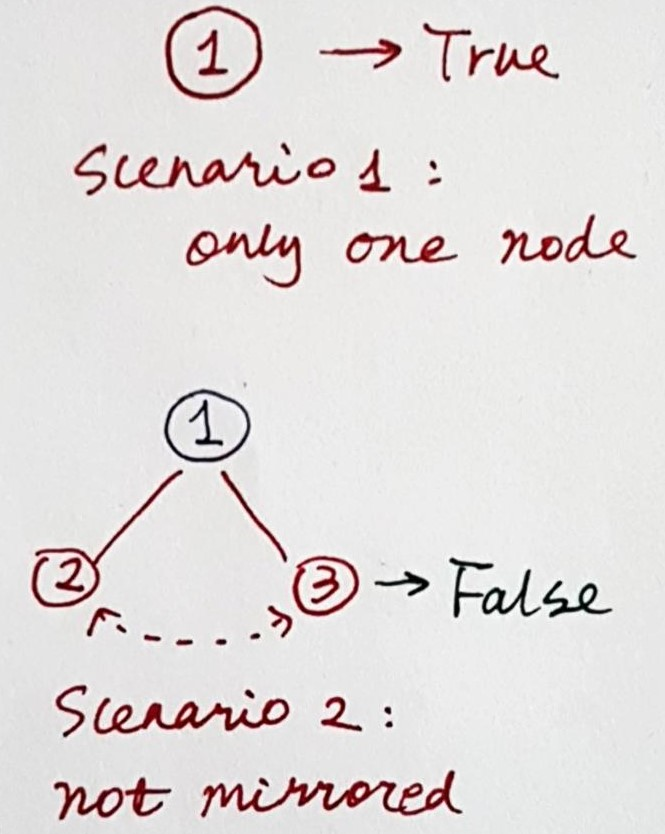
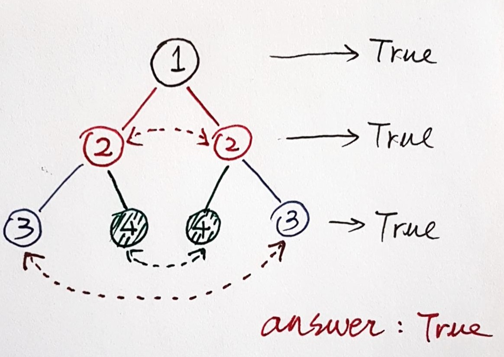

# 101. Symmetric Tree
Given a binary tree, check whether it is a mirror of itself (ie, symmetric around its center).

For example, this binary tree [1,2,2,3,4,4,3] is symmetric:

        1
       / \
      2   2
     / \ / \
    3  4 4  3
 

But the following [1,2,2,null,3,null,3] is not:

      1
     / \
    2   2
    \   \
    3    3
 

**Note**:
Bonus points if you could solve it both recursively and iteratively.

# 分析
这道题的要求是判断一棵树是否是对称的。在做这个题的时候，我们应该从以下的几个方面考虑：

1. 如果这棵树是对称树，那么我们可以得出结论，这棵树的每一层都是对称的。有了这个结论，我们可以从树根到树叶，一层层判断，当所有层都是对称的，我们就可以判断整树是对称的
2. 在每一层进行判断的时候，我们要引入一个概念：“镜像位”。每一层都应该是左右对称的，也就是说最左面的节点和最右面的节点是镜像位。举例，如果有一层有以下几个节点：①，②，③和④，那么①和④是镜像位，②和③是镜像位。***只有一层中所有在镜像位上的节点对相等，才能判定这一层是对称的***。
3. 如果在一层中有空节点时怎么处理。如果两个空节点出现在镜像位上，那么我们跳过这个镜像位的对比。
4. 如果整树是一棵空树，那么无所谓是不是对称的，我们直接返回False。
5. 如果树只有一个根节点，那么肯定是对称的。

基于以上的分析，我画了一些示意图：






# 实现方法
## 方法一，Recursive
在这种方法中，我们递归地将左，右两个树枝进行比较。
```Python
def isSymmetric_recr(self, root: TreeNode) -> bool:
    def isMirror(node1: TreeNode, node2: TreeNode) -> bool:
        if not node1 and not node2:
            return True
        if not node1 or not node2:
            return False
        return node1.val == node2.val and \
                isMirror(node1.left, node2.right) and \
                isMirror(node1.right, node2.left)
    return isMirror(root.left, root.right)
```
## 方法二，BFS
```Python
def isSymmetric(self, root: TreeNode) -> bool:
    if not root:
        return True
    from collections import deque
    queue = deque([(root.left, root.right)])
    while queue:
        node1, node2 = queue.popleft()
        if not node1 and not node2:
            continue
        if not node1 or not node2:
            return False
        if node1.val != node2.val:
            return False
        queue.extend([(node1.left, node2.right), (node1.right, node2.left)])
    return True
```