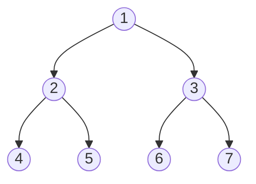

#### [116. 填充每个节点的下一个右侧节点指针](https://leetcode-cn.com/problems/populating-next-right-pointers-in-each-node/)

难度**中等**

给定一个**完美二叉树**，其所有叶子节点都在同一层，每个父节点都有两个子节点。二叉树定义如下：

struct Node {
  int val;
  Node *left;
  Node *right;
  Node *next;
}

填充它的每个 next 指针，让这个指针指向其下一个右侧节点。如果找不到下一个右侧节点，则将 next 指针设置为  `NULL`。

初始状态下，所有 next 指针都被设置为  `NULL`。

**示例：**


解释：给定二叉树如图 A 所示，你的函数应该填充它的每个 next 指针，以指向其下一个右侧节点，如图 B 所示。

提示：

你只能使用常量级额外空间。
使用递归解题也符合要求，本题中递归程序占用的栈空间不算做额外的空间复杂度。


### Solution

**(1)BSF**
这是马上就想到的方法，因为是非常典型的宽度优先搜索

每层搜索时，初使化pre指针，每次出桡时将pre.next指向当前节点即可

**Tips**
- deque 是来自collections 而不是直接import 

```python
from collections import deque 
class Solution:
    def connect(self, root: 'Node') -> 'Node':
        if not root:
            return root

        q = deque([root])
        while q:
            pre = None 
            for _ in range(len(q)):
                node = q.popleft()
                if pre:
                    pre.next = node 
                pre = node 
                if node.left:
                    q.append(node.left)
                if node.right:
                    q.append(node.right)

        return root 
```
代码效率并不高，待改进：

- 执行用时 :128 ms, 在所有  Python3  提交中击败了10.70%的用户
- 内存消耗 :15.1 MB, 在所有  Python3  提交中击败了5.08%的用户

**(2)利用完全树特点**

由于是完全树，所以，可以设定每个左子next -> 右子:
- 2->3,  4->5, 6->7

右子连接相邻堂兄弟结点时，可利用上一层的next 找到党叔，再找其左子:
- 5->6:  5  ^ 2 -> 3 -> 6 



代码：
```python
class Solution:
    def connect(self, root: 'Node') -> 'Node':
        veryLeftOfCurrentLevel = root 
        while veryLeftOfCurrentLevel:
            currNode = veryLeftOfCurrentLevel
            while True :
                if currNode.left:  # not the leaf node 
                    currNode.left.next = currNode.right 

                if not currNode.next: # the very right node 
                    break 
                
                if currNode.right:  # not the leaf node 
                    currNode.right.next = currNode.next.left 

                currNode = currNode.next        

            veryLeftOfCurrentLevel = veryLeftOfCurrentLevel.left 

        return root 
``` 
