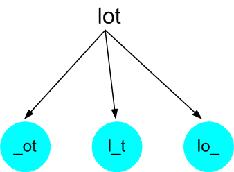
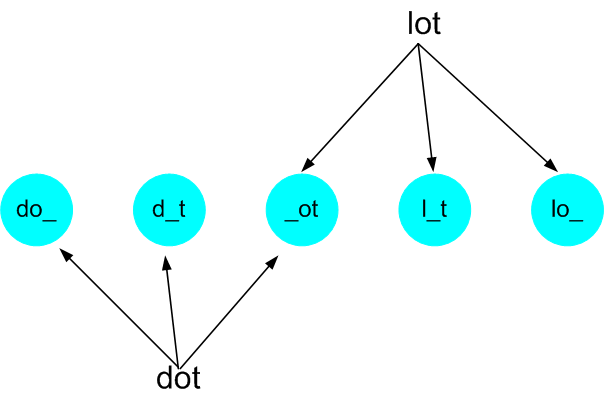
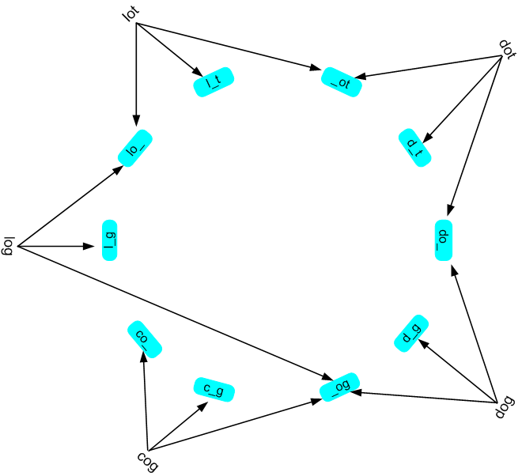

# 分析：
本题是典型的BFS题型。要解本题的前提条件是一定要对BFS有一个透彻的了解。

BFS非常适合用于求解一张图中两点之间的最短路径类的题型。本题的中提到：the length of shortest transformation sequence from beginWord to endWord。所以我本能地想到要用BFS来求解。Leetcode上给出的Solution非常好，现在我将我在学习它的解决方案过程的理解记录如下。

## 第一步
解题的第一步是要构建出一个图，这个图中包含题目输入的wordList
中的每个字及其之间的关系。我个人认为构建这个关系图是每一道BFS题的最关键的一步。这个关系图或者由题目直接输入，或者通过题目的输入信息由我们来构建。
这个题目给出了一系列的等长的英文字，我们要分析它们之间的关系。题目要求对于wordList中的任何一个字，每次我们只能改变一个字符。为了方便，我用下面的输入作为一个例子来分析：
```python
startWord = 'lot'
endWord = 'cog'
wordList = ['lot', 'dot', 'dog', 'cog', 'log']
```
我们就拿'lot'来分析，每次可以改变一个字符，可以在这个字的任意一个字符位上改，那么就会有很多可能的新字出现。比如我们改变‘l’，很显然26个英文字符，除了'l'之外都是符合要求的，至于改变了字符后出现的新字是不是一个有效的英文单词，那是另一个问题，我们不用考虑。所以在改变了'l'之后，可以出现如下的单词：

|原单词|新“单词”|
|---|:---:|
|lot|aot, bot, cot, dot, eot, fot, got .....|
|||

通过上面的分析，我们可以看到每一个字符位，我们可以产生25个新“单词”， 虽然很多的看起来都很不靠谱。再仔细想想，我们没有必要知道这一位字符改变成什么新字符，我们只要知道它改变了，也就是说我们可以不关心具体改变成为什么新字符，我们只要知道它在某一个字符位上改变了就行。所以lot可以衍生出_ot, l_t, 和lo_。这里我用下划线表示任意字符，如下图所示：



这样我们就产生了一个树状的结构。通过这个结构我们可以将两个单词的相互关系表示出来。比如lot和dot这两个词的关系如下图所示：



对于我们这个上面的例子，将所有的词都用这样的图表示，我们就构建出了一张关系图，我们可以通过这张图来求解两点之间的最短距离。



```python
# Creating graph
word_graph = defaultdict(list)
for word in wordList:
    for i in range(len(word)):
        word_graph[word[:i] + '_' + word[i+1:]].append(word)
```

## 第二步
根据题目的要求，像填空一样把关键的信息填写到BFS的模板程序中。

### Edge cases
1. endWord不在wordList中
2. wordList为空
3. beginWord为空字符串

### code
```Python
class Solution:
    def ladderLength(self, beginWord: str, endWord: str, wordList: List[str]) -> int:
        from collections import defaultdict
        from collections import deque
        if not wordList or endWord not in wordList or not beginWord:
            return 0
        LEN = len(beginWord)
        word_graph = defaultdict(list)
        for word in wordList:
            for i in range(LEN):
                word_graph[word[:i] + '_' + word[i+1:]].append(word)
        queue = deque([(beginWord, 1)])
        seen = set(beginWord)
        while queue:
            cur_word, distance = queue.popleft()
            for i in range(LEN):
                temp_word = cur_word[:i] + '_' + cur_word[i+1:]
                for word in word_graph[temp_word]:
                    if word not in seen:
                        if word == endWord:
                            return distance + 1
                        seen.add(word)
                        queue.append((word, distance+1))
                word_graph[temp_word] = []
        return 0
```