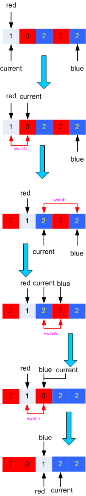

# 75. Sort Colors
Given an array with n objects colored red, white or blue, sort them in-place so that objects of the same color are adjacent, with the colors in the order red, white and blue.

Here, we will use the integers 0, 1, and 2 to represent the color red, white, and blue respectively.

Note: You are not suppose to use the library's sort function for this problem.

### Example:
```python
Input: [2,0,2,1,1,0]
Output: [0,0,1,1,2,2]
```

### Follow up:

* A rather straight forward solution is a two-pass algorithm using counting sort.
First, iterate the array counting number of 0's, 1's, and 2's, then overwrite array with total number of 0's, then 1's and followed by 2's.
* Could you come up with a one-pass algorithm using only constant space?

# Analysis
In the follow-up part of the question, there is a straightforward two-pass method mentioned. I first implemented this natural algorithm.
## 1. two-pass solution
The main idea of this solution is to count the 0's, 1's, and 2's items and overwrite the original array by using these counts. So, we count the occurrence of the 0, 1, and 2 in the first pass. To count the occurrence is quite simple, in any case. We can get help from the Python built-in data structure, Counter, to make it. 
```Python
from collections import Counter
counter = Counter(nums)
# If the nums is [0, 1, 2, 0, 2, 1]
# Then the counter is {0: 2, 1: 2, 2: 2}
# The keys in the counter is the distinct items in the original list
# The value of the counter is the occurrences
```
Once we get the occurrences of 0's, 1's and 2's, the rest task becomes quite simple:
```Python
nums[0: counter[0]] = [0] * counter[0]
nums[counter[0]: counter[0] + counter[1]] = [1] * counter[1]
nums[counter[0] + counter[1]:] = [2] * counter[2]
```
## 2. One-pass solution

In this method, we use three pointers, which are 'red' for the current 0 position, 'current' for the index of the current item in the array, and 'Blue' for the corrent position for 2s.

In the beginning, the 'red' and 'current' all starts from 0, on the contrary, 'blue' starts from rightside of the array.
```python
red, current, blue = 0, 0, len(nums)-1
```
Then, we can scan the array from left to right, the current value is in the following three scenarios:

1. Suppose the value is 0, this value should be moved to the left side of the array, where all 0s locate. We implement this by switch the values in the 'red' position and 'current' position. After switching the value, we move 'red' and 'current' one slot to the right by one.
2. The value is 1, we simply leave it and move the 'current' to the next place in the array.
3. If it is 2, we switch the values in the 'blue' position and 'current' position. There is an edge case we must handle, suppose the value on the 'blue' position is already 2, this makes us switch two 2s. That means after switching, the value on the 'current' position is still 2, which is not handled properly. So, we only move the 'blue' pointer one spot to the left and leave the 'current' unchanged. 

When the 'current' pointer crosses the 'blue' pointer, we can stop our scan.  
